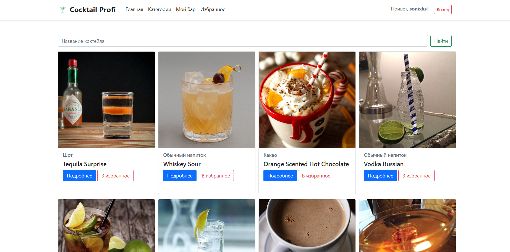
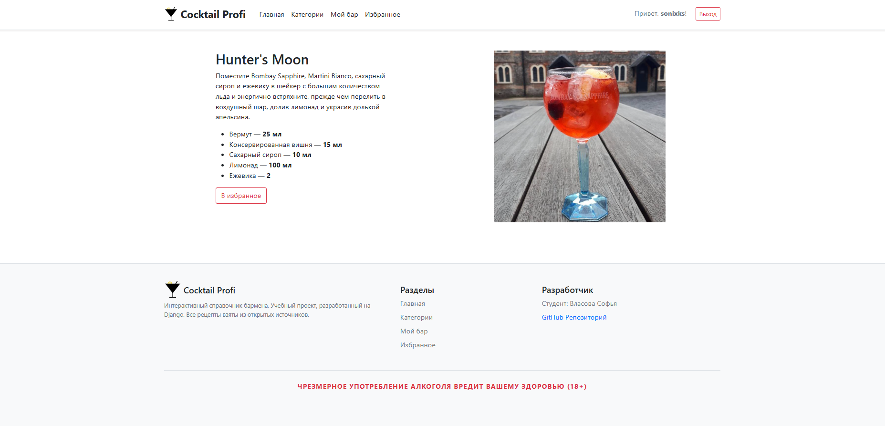
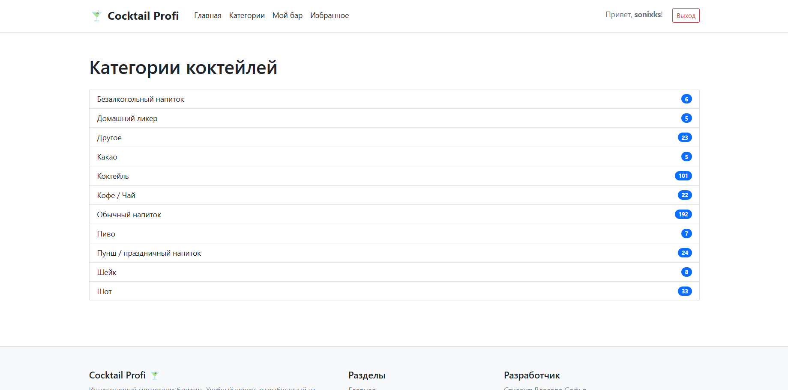
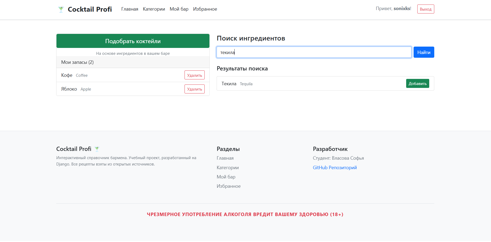
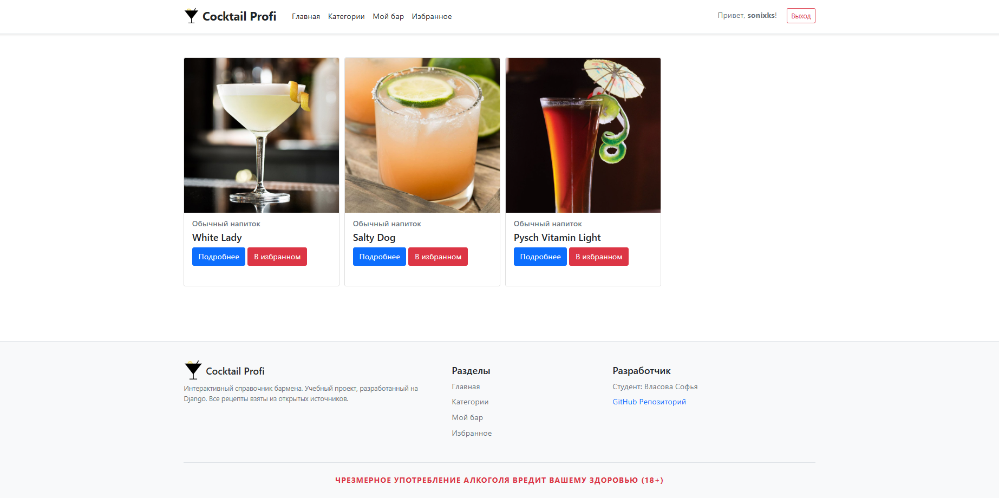

# Coctail Profi

Сервис подбора рецептов коктейлей на основе выбранных ингредиентов. Помогает домашним барменам-любителям найти новые идеи коктейлей через случайную подборку, а также подсказывает, какие коктейли можно приготовить из того, что уже есть у вас дома, экономя время и деньги на лишние покупки.

**Ссылка на рабочий проект:** https://sonixks.pythonanywhere.com/

## Стек технологий
* **Backend:** Python 3.13, Django 6.0
* **Database:** SQLite
* **Integration:** API TheCocktailDB (база данных коктейлей)
* **Frontend:** Django-bootstrap5 25.3

## Интерфейс
1. 
*Общий каталог со случайной подборкой коктейлей.*

2. 
*Карточка коктейля с подробным описанием (фото, ингредиенты, инструкция).*

3. 
*Здесь можно найти нужную категорию коктейлей.*

4. 
*Здесь можно найти и сохранить список ингредиентов, которые есть у Вас в наличии.*

5. 
*Подборка коктейлей на основе сохраненных ингредиентов.*

6. 
*Каталог с понравившимися коктейлями.*

## Как запустить проект локально
1. **Клонируйте репозиторий:**
   ```bash
   git clone https://github.com/sonixks/cocktail-profi.git
   ```
2. **Создайте и активируйте виртуальное окружение:**
   ```bash
   python -m venv venv
   source venv\Scripts\activate
   ```
3. **Установите зависимости:**
   ```bash
   pip install -r requirements.txt
   ```
4. **Выполните миграции:**
   ```bash
   python manage.py migrate
   ```
5. **Запустите сервер:**
   ```bash
   python manage.py runserver
   ```
6. **Откройте проект в браузере:**
   Перейдите по ссылке: http://127.0.0.1:8000/
